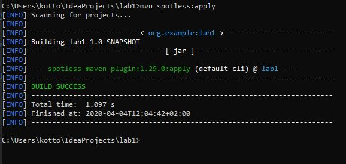
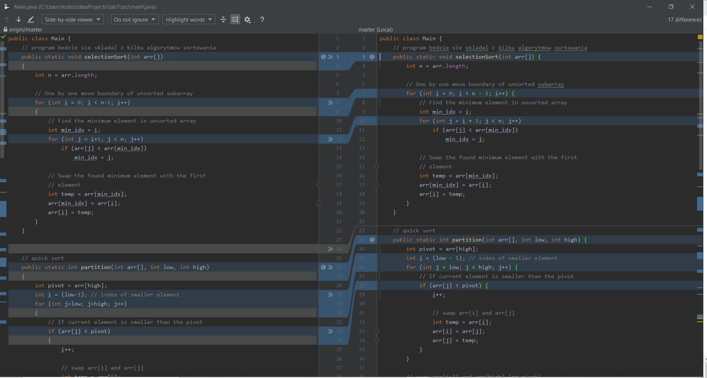
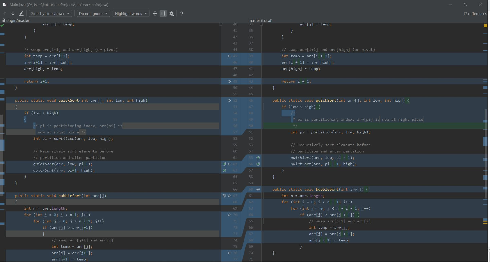
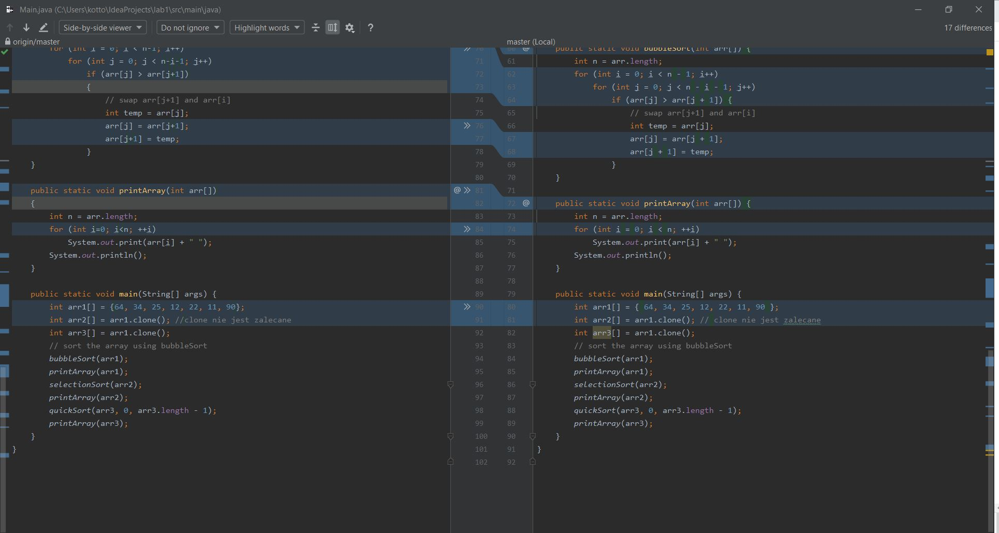
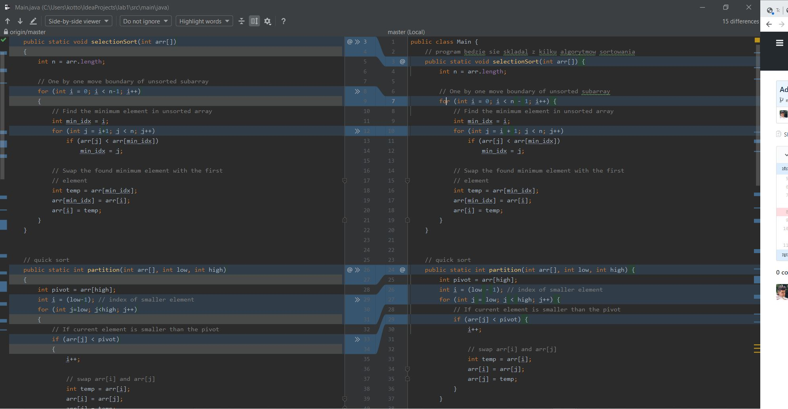
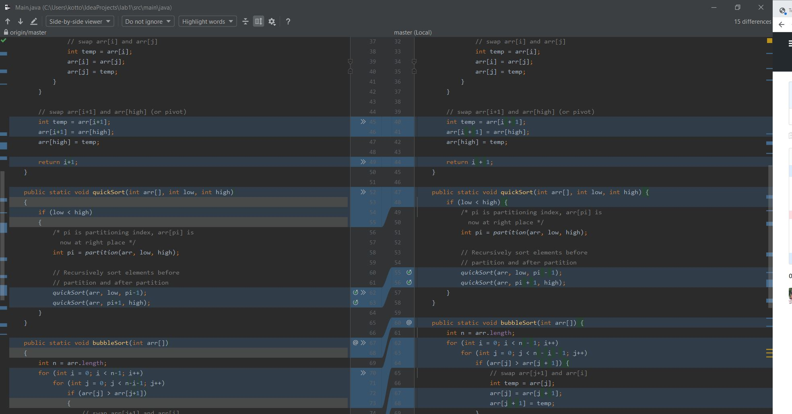
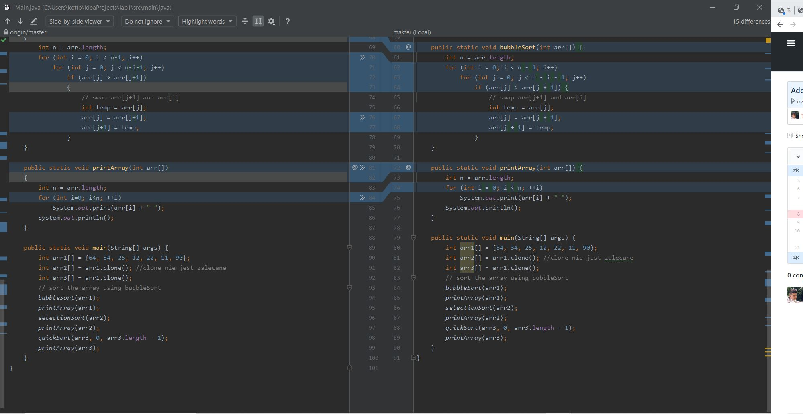
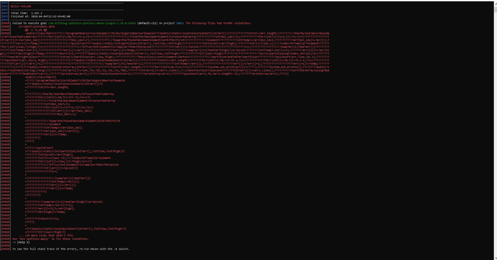
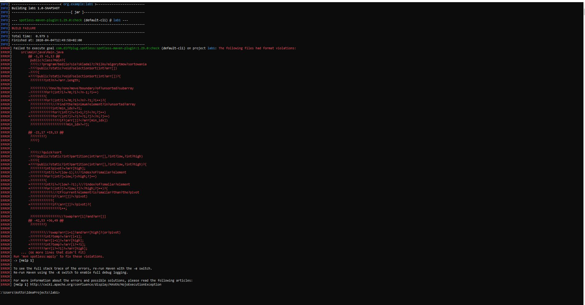
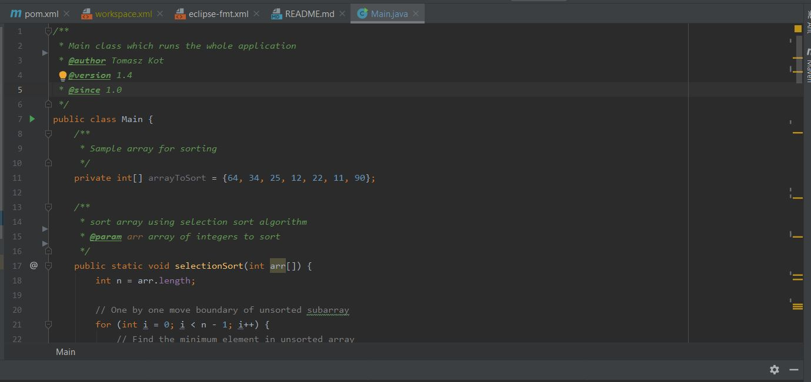

<h1>Tomasz Kot 233 978</h1>

<strong>Uwaga: Napisany program nie zachowuje dobrych praktyk programistycznych w jezyku Java. Jest to wykonane
specjalnie by narzędzia używane w ćwiczeniu mogły się wykazać. Autor zaznacza, że większość kodu została zainspirowana "złym" (z punktu widzenia stylu i konwencji) kodem
z Internetu. Ponadto sens samego projektu jest wątpliwy - kod ma służyć tylko zapoznaniu z tematyką Fromatowania kodu w kontekście Tworzenia i utrzymywania czystego kodu.</strong>

<h1>Zad 1</h1>

Wynik wykonania komendy <strong>spotless:check</strong> został przedstawiony na zrzucie ekranu

Jak widać w projekcie algorytmów sortowania (specjalnie napisanych w złym "stylu") mamy pełno 
ostrzeżeń odnośnie stylu w pliku Main.java. Przy pomocy uruchomienia komenty <strong>mvn spotless:apply </strong>
można owe problemy ze stylem usunąć co autor uczynił.

Jeśli chodzi o zapis <strong>@@ -33,7 +33,6 @@</strong> bądź (ze zrzutu ekranu  <strong>@@ -42,53 +36,49 @@</strong>)
jest zapisany w formacie jaki wyświetla się również np. w narzędziu Git. Ma on format @@ from-file-range to-file-range @@.
from-file-range składa się z <start-line>, <number-of-lines> oraz to-file-range <start_line>, <number_of_lines>. Jeśli <number_of_lines>
się nie wyswietla to oznacza, że jest równy zero. Znak minusa mówi o "starym pliku" natomiast "+" o nowym pliku. W kontekście narzędzia spotless
oznacza to różnicę między plikiem analizowanym i tym, który powstanie po uruchomieniu <strong>mvn spotless:apply</strong> a więc "poprawnym" ze względu
na zdefiniowane reguły.

<strong>mvn spotless:apply</strong>  

Różnice pokazane przy pomocy Diff:

Jak widać różnice polegały głównie na znakach spacji oraz przeniesieniu znaków '{' do tych samych linijek, w których znajdują się np. instrukcje for.
Wyrównano również np. znaki komentarzy blokowych '/*'.
<h1>Zad 2</h1>

Wyniki wywołania <strong>Reformat Code</strong> dla narzędzia <strong>Google Java Format</strong>

Jak widać narzędzie Google Java Format, podobnie jak spotless, dołączyło wszystkie nawiasy klamrowe do linii, w których wywołana
została odpowiednia instrukcja. Ponadto poprawia ono wcięcia oraz dodaje spacje - np. w instrukcji for pomiędzy poszczególnymi średnikami.
Warto wspomnieć zgodnie z wątkiem na <a href="https://stackoverflow.com/questions/50027892/override-google-java-format-with-spotless-maven-plugin">StackOverflow</a>
że Java Google Formatter nie udostępnia takiej możliwości konfiguracji jak narzędzie spotless.

<h1> Zad 3 </h1>

Spotless używa UTF-8 domyślnie. Po zmianie na Cp1252. Zatem teraz będziemy używać Windowsowych znaków końca linii. Oczwyiście plik Main.java został
taki sam jak przed każdym z punktów tzn. nie jest on wynikiem wykonania np. komendy mvn spotless:apply.

Po samej zmianie:

Jak widać plik ma kodowanie UNIXOWE końca linii. Narzędzie spotless się "zgubiło" i nie mogło odczytać końcówek linii poprawnie stąd odczytało część pliku jako jedną linię.
Zmieniamy znak końca linii w konfiguracji i otrzymujemy poprawny wynik: 

<h1>Zad 4</h1>
<strong>Uwaga: Z racji, że "projekt" posiada jedynie jedną klasę jako opis opisano jedynie plik Main.java, w punkcie tym sztucznie dodano również properties do klasy Main.java</strong>

Zrzut fragmentu wygenerowanej dokumentacji JavaDocs został przedstawiony poniżej: 

<h1>Pytania weryfikacyjne</h1>

<strong>Pytanie 1</strong> 
Na sformatowanie automatyczne kodu pozwala plugin <strong>Google Java Formatter</strong>. 
<strong>Pytanie 2</strong> 
Dla języka Java - odpowiednio dla Google Java Format jest to <strong>Google Java Style</strong>. Wtyczka spotless również "supportuje" ten styl jednakże (dla języka Java)
dodaje również standard który można określić jako <strong>Eclipse Java Code Formatter</strong>  
<strong>Pytanie 3</strong> 
Spośród poznanych wtyczek w ćwiczeniu największą możliwość dostosowania konfiguracji posiada wtyczka Spotless. Dzieje się to poprzez plik XML.  
<strong>Pytanie 4</strong> 
Ważne jest by wykonywać automatyczne formatowanie ponieważ jakość (właściwie: czystość) kodu jest czymś o czym łatwo zapomnieć w czasie
rozwiązywania problemu programistycznego. Dzięki automatyzacji tego procesu chociaż w ograniczym do dokładności działania danego narzędzia zakresie zadbamy o taką czystość.
Ponadto pluginy często mają zaimplementowane pewne mechanizmy uznane jako "standard" w danej społeczności (style guidelines) - np. Rubocop w języku Ruby. Dzięki temu po pierwsze - mamy możliwość 
ich poznania, a po drugie stosujemy uczynimy nas kod łatwiejszym w cztaniu i utrzymywaniu (a więc i tańszy w tym zakresie :) ) dla innych poprzez stosowanie umownych reguł. Jeśli w danej organizacji obecny jest również pewien <i>standard kodowania</i>
możemy poprzez współdzielony plik konfiguracyjny np. dla Rubocop rubocop.yml szerzyć powszechną automatyzacje dbania o formatowanie w orgazniacji, w której pracujemy. Formatowanie kodu może również automatyzować generacje dokumentacji -np. Javadocs lub YARD dla Ruby.